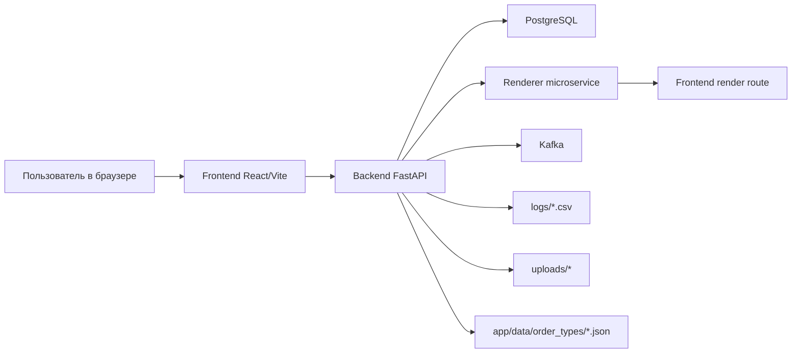

# Архитектура

## Общая схема



## Компоненты

### Frontend

Каталог: `frontend/`

Основные части:

- `src/App.jsx` - маршрутизация экранов и восстановление сессии;
- `src/api.js` - клиент HTTP API;
- `src/components/ClientDashboard.jsx` - личный кабинет клиента;
- `src/components/DealerDashboard.jsx` - служебная панель дилера/администратора;
- `src/components/Interface.jsx` и соседние компоненты - 3D-конфигуратор.

Frontend хранит JWT в cookie/localStorage только при согласии на cookie. Если согласия нет, токен живет в памяти текущей вкладки.

### Backend

Каталог: `backend/`

Технологии:

- FastAPI;
- SQLAlchemy async;
- Alembic;
- Pydantic v2;
- SlowAPI для rate limit;
- python-jose для JWT;
- aiokafka для событий.

Главная точка входа: `backend/app/main.py`.

Основные слои:

| Слой | Каталог | Ответственность |
| --- | --- | --- |
| API | `app/api/v1` | HTTP endpoints и проверка прав |
| Core | `app/core` | безопасность, зависимости, Kafka, логирование |
| CRUD | `app/crud` | запросы к базе |
| Models | `app/models` | SQLAlchemy-модели |
| Schemas | `app/schemas` | Pydantic-схемы |
| Services | `app/services` | бизнес-операции |

### Renderer

Каталог: `microservices/renderer/`

Сервис получает JSON-конфигурацию, открывает frontend route в headless Chromium, ждет `window.__3D_READY__ === true` и возвращает PNG. Backend сохраняет файл в `uploads/renders`.

## Поток создания заказа

1. Клиент отправляет `POST /api/v1/orders/`.
2. Middleware записывает HTTP-событие.
3. Backend извлекает `configuration.productConfig`.
4. Backend вызывает `renderer:3000/render`.
5. Renderer делает PNG-снимок.
6. Backend сохраняет render.
7. `OrderService` создает запись в таблице `orders`.
8. Backend пишет `ORDER_CREATED` в CSV-лог.
9. Backend отправляет Kafka-событие `ORDER_CREATED`.
10. Frontend получает id заказа и обновляет кабинет клиента.

## Модель данных

### `users`

Ключевые поля:

- `id`;
- `email`;
- `password_hash`;
- `role`;
- `sub_role`;
- `token_balance`;
- `company_name`.

### `orders`

Ключевые поля:

- `id`;
- `user_id`;
- `user_email`;
- `product_name`;
- `status`;
- `configuration` JSONB;
- `quantity`;
- `total_price`;
- `currency`;
- `stage_history` JSONB;
- `created_at`;
- `updated_at`.

### `products`

Ключевые поля:

- `id`;
- `dealer_id`;
- `name`;
- `binding`;
- `spiral_colors`;
- `elastic_colors`;
- `formats`;
- `cover_colors`;
- `retail_price`;
- `wholesale_tiers`.

## JSON типы заказов

Файлы лежат в:

```text
backend/app/data/order_types/*.json
```

Путь можно переопределить переменной `ORDER_TYPES_DIR`.

Backend защищает доступ:

- только `admin` и `owner`;
- имена файлов проходят whitelist-валидацию;
- JSON должен быть объектом;
- запись выполняется через временный файл и атомарную замену.

## Логирование событий

Логгер находится в `backend/app/core/event_logger.py`.

Записываются:

- все HTTP-запросы пользователя к backend;
- startup/shutdown backend;
- события Kafka producer;
- запросы backend к renderer;
- создание заказов;
- смена статусов;
- изменения продуктов;
- обновления JSON типов заказов;
- загрузки файлов.

Формат CSV выбран потому, что его легко анализировать стандартными средствами и импортировать в BI/таблицы. Лимит 10 000 строк предотвращает бесконтрольный рост одного файла.

## Безопасность

Реализованные меры:

- CORS ограничивается `ALLOWED_ORIGINS`, wildcard с credentials больше не используется;
- JWT secret обязателен в production;
- добавлены базовые security headers;
- query-параметры с секретами маскируются в логах;
- публичная регистрация не повышает роль пользователя;
- дилер не может управлять чужими продуктами;
- дилер не может управлять заказом без привязки `dealerId`;
- загрузка логотипов требует служебную роль и проверяет сигнатуру файла;
- renderer ограничивает размер JSON и кодирует конфиг в URL.

## Ограничения и зоны развития

- Для строгой дилерской модели лучше добавить `dealer_id` как отдельную колонку в `orders`, а не хранить связь только в JSON-конфигурации.
- Для production-аудита желательно отправлять CSV-логи в централизованную систему: ELK, Loki, ClickHouse или S3-compatible storage.
- Для управления ролями нужен отдельный доверенный административный процесс.
- Текущий frontend использует локальное состояние экранов, а не полноценный router.

